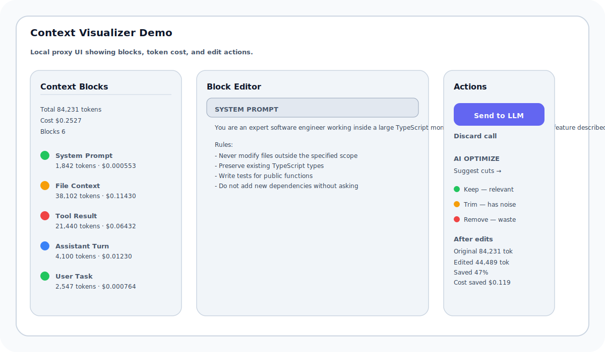

# Context Visualizer

A local proxy and interactive review dashboard for AI coding agents. The tool intercepts the final LLM request before it reaches Anthropic or OpenAI, shows the full context by block, and lets developers edit or trim content before it is sent.

## Key Features

- Intercepts the final model request from AI agents such as Claude Code, Codex, Cursor, and other OpenAI-compatible tools
- Shows all context blocks with type labels, token counts, and estimated cost
- Lets users edit or delete individual blocks before forwarding the request
- Streams the real API response back to the waiting agent connection
- Supports both Anthropic and OpenAI-compatible request formats
- Includes an AI suggestion helper to recommend blocks to keep, trim, or remove

## Quick Start

1. Clone the repository
2. npm install
3. cp .env.example .env
4. Update `.env`:
   - `TARGET_API=https://api.anthropic.com` or `https://api.openai.com`
   - Optional: `PROXY_PORT=3131`, `FINAL_CALL_TOKEN_THRESHOLD=8000`
5. npm run build
6. npm start
7. Open the dashboard at `http://localhost:3131/ui`

## Development

- `npm run dev:ui` — run the React UI with Vite for fast local development
- `npm start` — start the local proxy server

## Usage

### With Claude Code

```bash
export ANTHROPIC_BASE_URL=http://localhost:3131
claude
```

### With OpenAI-Compatible Agents

Set the agent's API base URL to:

```bash
http://localhost:3131
```

## How It Works

The proxy listens on `http://localhost:3131` and handles any OpenAI-compatible or Anthropic model request. It detects the final call when either:

- the request has no `tools` array, or
- the total estimated token count exceeds the configured threshold

When the final call is intercepted, the request is held open while the UI displays the parsed context. Users can edit blocks, then either send the cleaned request or discard it.

## Architecture

The system consists of three main components:

- **AI Agent** — sends requests to the local proxy instead of the upstream API
- **Local Proxy** — intercepts final requests, stores pending payloads, serves the UI, and forwards edited payloads to the real API
- **Browser UI** — receives SSE notifications, renders block context, and lets the user edit before sending


## Demo

The demo image below shows the UI structure with the context block list, editable prompt content, action controls, and cost/tokens summary.



## UI Panels

- **Context Breakdown** — lists each block with type, token count, cost, and suggestion badges
- **Context Editor** — edit content inline and see live token updates
- **Actions & Suggestions** — send, discard, or request AI optimization recommendations

## Proxy Behavior

- All intercepted requests preserve the original `Authorization` header
- The proxy forwards real API responses back to the agent, including streaming responses
- Pending requests are stored in memory and expire after 10 minutes
- The UI is served from `dist/ui` and is loaded from `/ui`

## Token Counting & Costs

Token counts are calculated locally using `js-tiktoken`:

- Claude models use `o200k_base`
- OpenAI models use `cl100k_base`

Rates are defined in `src/config/rates.json` and the cost formula is:

```js
cost = (tokens / 1_000_000) * modelRate;
```

## Repository Structure

- `src/proxy/` — local proxy server, interceptor, forwarder, block classification, request store
- `src/ui/` — React dashboard and UI components
- `src/config/rates.json` — model pricing table
- `.env.example` — runtime configuration template

## License

This project is licensed under the MIT License.
